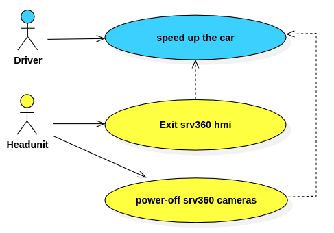

# Extreme Energy Saving Strategy for FICM - SRV360

## 0 Legend

| Version | Description     | Date       | Author |
| ------- | --------------- | ---------- | ------ |
| 1.0     | First released. | 2024-02-28 | 罗均   |

## 1 Overview

### 1.1 Background

From the eletrical-battery-power-train vehicle perspective, any consumption of low-voltage-system eletrical components might produce the non-essentional waste of battery power, which could has impact to vehicle users' real capable mileage.

Therefore, this solution is trying to save low-voltage-system eletrical components consumption while users are not using. In addition, the applied energy saving solution would not cause any obvious unhappy exerperience from user standpoint.

### 1.2 Requirements Brief

Regarding to the external SRV360(SurRounding View 360 degrees) four cameras which have approximately 4W power consumption (about 1W per camera).

If an eletrical vehicle's power efficiency is 9km/1kwh, saving 4W power consumption could contribute approximately extra 4 multiplies 9 equals 36m of moving range per hour.

Therefore it is valuable to design and apply an "extreme" energy saving strategy for this extra 54m moving range from user usage perspective.

### 1.3 Acronyms

- FICM: Front Infortainment Control Module
- ICM: Infortainment Control Module
- SRV360: SurRounding View 360 degrees
- PMIC: Power Management Integrated Circuit
- SoC: System on Chip
- MCU: Micro Controller Unit

## 2 Scope

### 2.1 Functional Scope

This specification is **ONLY** applicable for the "extreme" energy saving strategy of _FICM_ SRV360 function.

### 2.2 Vehicle Program Scope

This specification is applicable for **ALL** SAIC vehicle programs installed with latest FICM platforms included:

- FICM JFK8015 integrated with HD digital SRV360 cameras
- FICM MT2712 integrated with HD digital SRV360 cameras
- FICM MT8666 integrated with HD digital SRV360 cameras
- ICM SA8155P integrated with HD digital SRV360 cameras

Note: ICM SA8155P might has differrent solutions, which is still in developing.

### 2.3 Hardware Block Diagram


- Power of SRV360 cameras are controlled by FICM-MCU's **enbale** wire.
- Once the system chooses to close the power of SRV360 cameras, the power of de-serializer keeps the same.

### 2.4 Regulation

- R158

Assessment: no impact.

## 3 Functional Requirements

### 3.1 REQ_EES_SRV360_000

#### 3.1.1 Description

Power of SRV360 cameras should be **power-off** while **ALL** of the **Pre-conditions** satisfied as below for energy saving purpose.

#### 3.1.2 Pre-conditions

<!-- - [CAN Signal: SysPwrMd](#syspwrmd) == RUN -->
<!-- - [CAN Signal: VehSpdAvgDrvn](#VehSpdAvgDrvn) > [Internal Signal: SRV360AppAvailableSpeedSetting](#SRV360AppAvailableSpeedSetting) -->

- [SystemMode: HeadunitPowerMode](#headunitpowermode) == _`running`_
- [CAN Signal: VehSpdAvgDrvn](#VehSpdAvgDrvn) > [Internal Signal: EES_SRV360CameraPowerOffSpeed](#EES_SRV360CameraPowerOffSpeed)
- [Internal Signal: DvrSDCardPluginStatus](#DvrSDCardPluginStatus) == SD_CARD_NOT_PLUG_IN (if applicable)

#### 3.1.3 Use Cases

- [UC_EES_SRV360_000: Headunit sets SRV360 Cameras Power OFF](#uc_ees_srv360_000-system-sets-srv360-cameras-power-off)

#### 3.1.4 Post-conditions

- [Internal Signal: SRV360CameraPowerStatus](#SRV360CameraPowerStatus) == OFF

#### 3.1.5 Dependecies

N/A

### 3.2 REQ_EES_SRV360_001

#### 3.2.1 Description

Power of SRV360 cameras should be **power-on** while **ANY** of the **Pre-conditions** satisfied as below for SRV360 functionality available.

#### 3.2.2 Pre-conditions

- [SystemMode: HeadunitPowerMode](#headunitpowermode) == _`running`_
- [CAN Signal: VehSpdAvgDrvn](#VehSpdAvgDrvn) > ([Internal Signal: EES_SRV360CameraPowerOffSpeed](#EES_SRV360CameraPowerOffSpeed) + [Internal Signal: EES_SRV360CameraPowerOnSpeedOffset](#EES_SRV360CameraPowerOnSpeedOffset))
- [Internal Signal: DvrSDCardPluginStatus](#DvrSDCardPluginStatus) == SD_CARD_NOT_PLUG_IN (if applicable)

#### 3.2.3 Use Cases

- [UC_EES_SRV360_001: Headunit sets SRV360 Cameras Power ON](#uc_ees_srv360_001-system-sets-srv360-cameras-power-on)

#### 3.2.4 Post-conditions

- [Internal Signal: SRV360CameraPowerStatus](#SRV360CameraPowerStatus) == ON

#### 3.2.5 Dependecies

N/A

### 3.3 REQ_EES_SRV360_003

#### 3.3.1 Description

For the purpose of intenral EMC performance and camera protection, power of SRV360 cameras should **NOT** be **power-on** and **power-off** with high frequency.

#### 3.3.2 Pre-conditions

As same as [REQ_EES_SRV360_000](#31-req_ees_srv360_000)

- Plus [Internal Signal: EES_SRV360CameraPowerOffTimerStatus](#EES_SRV360CameraPowerOffTimerStatus)

#### 3.3.3 Use Cases

- [Internal Signal: EES_SRV360CameraPowerOffTimerStatus](#EES_SRV360CameraPowerOffTimerStatus) == standby -> [UC_EES_SRV360_001: Headunit sets SRV360 Cameras Power ON](#uc_ees_srv360_001-system-sets-srv360-cameras-power-on)

#### 3.3.4 Post-conditions

- [Internal Signal: EES_SRV360CameraPowerOffTimerStatus](#EES_SRV360CameraPowerOffTimerStatus) == standby -> [Internal Signal: SRV360CameraPowerStatus](#SRV360CameraPowerStatus) == OFF

#### 3.3.5 Dependecies

N/A

## 4 Entities

### HeadunitPowerMode

```json
{
  "EntityID": "REQ_EES_ENT_SRV000",
  "EntityName": "HeadunitPowerMode",
  "EntityType": "",
  "DataType": "Enumeration",
  "ValueRange": { "shutdown": 0, "STR": 1, "running": 2 },
  "InitialValue": "shutdown",
  "ExceptionValue": "shutdown",
  "Comments": "STR means SuspendToRAM."
}
```

### VehSpdAvgDrvn

```json
{
  "EntityID": "REQ_EES_ENT_SRV100",
  "EntityName": "VehSpdAvgDrvn",
  "EntityType": "",
  "DataType": "float",
  "ValueRange": "(0 - 32767 * 0.015625) km/h",
  "InitialValue": 0,
  "ExceptionValue": 0,
  "Comments": "Vehicle average speed received from CAN bus."
}
```

### DvrSDCardPluginStatus

```json
{
  "EntityID": "REQ_EES_ENT_SRV200",
  "EntityName": "DvrSDCardPluginStatus",
  "EntityType": "",
  "DataType": "Enumeration",
  "ValueRange": { "not-plugin": 0, "plugin": 1 },
  "InitialValue": "not-plugin",
  "ExceptionValue": "plugin",
  "Comments": "SD Card just means the memory medium for DVR video storage, it can be TF card or USB stick."
}
```

### SRV360CameraPowerStatus

```json
{
  "EntityID": "REQ_EES_ENT_SRV201",
  "EntityName": "SRV360CameraPowerStatus",
  "EntityType": "",
  "DataType": "Enumeration",
  "ValueRange": { "OFF": 0, "ON": 1 },
  "InitialValue": "OFF",
  "ExceptionValue": "OFF",
  "Comments": ""
}
```

### SRV360AppAvailableSpeedSetting

```json
{
  "EntityID": "REQ_EES_ENT_SRV202",
  "EntityName": "SRV360AppAvailableSpeedSetting",
  "EntityType": "",
  "DataType": "Enumeration",
  "ValueRange": { "15km/h": 0, "25km/h": 1, "35km/h": 2 },
  "InitialValue": "15km/h",
  "ExceptionValue": "15km/h",
  "Comments": ""
}
```

### EES_SRV360CameraPowerOnSpeedOffset

```json
{
  "EntityID": "REQ_EES_ENT_SRV203",
  "EntityName": "EES_SRV360CameraPowerOnSpeedOffset",
  "EntityType": "",
  "DataType": "int",
  "ValueRange": "(0 - 10) km/h",
  "InitialValue": 4,
  "ExceptionValue": 10,
  "Comments": "Internal value hard-coded in application."
}
```

### EES_SRV360CameraPowerOffSpeed

```json
{
  "EntityID": "REQ_EES_ENT_SRV204",
  "EntityName": "EES_SRV360CameraPowerOffSpeed",
  "EntityType": "",
  "DataType": "Enumeration",
  "ValueRange": { "50km/h": "15km/h", "60km/h": "25km/h", "70km/h": "35km/h" },
  "InitialValue": "50km/h",
  "ExceptionValue": "50km/h",
  "Comments": "Internal value hard-coded in application."
}
```

### EES_SRV360CameraPowerOffTimerStatus

```json
{
  "EntityID": "REQ_EES_ENT_SRV205",
  "EntityName": "EES_SRV360CameraPowerOffTimerStatus",
  "EntityType": "",
  "DataType": "Enumeration",
  "ValueRange": { "standby": 0, "activated": 1 },
  "InitialValue": "standby",
  "ExceptionValue": "activated",
  "Comments": ""
}
```

## 5 Use Cases

### 5.1 Use Case Models

#### UC_EES_SRV360_000: Headunit sets SRV360 Cameras Power OFF



#### UC_EES_SRV360_001: Headunit sets SRV360 Cameras Power ON


### 5.2 Business Rules

#### Arbitriation Table - 1

- **Inputs:**
  - [HeadunitPowerMode](#headunitpowermode)
  - [VehSpdAvgDrvn](#vehspdavgdrvn)
  - [DvrSDCardPluginStatus](#dvrsdcardpluginstatus)
- **Outputs:**
  - [SRV360CameraPowerStatus](#srv360camerapowerstatus)
  - [SRV360CameraPowerOffTimerStatus](#ees_srv360camerapowerofftimerstatus)

| Case No. | [Headunit<br>PowerMode](#headunitpowermode) |                                                                                            [VehSpdAvgDrvn](#vehspdavgdrvn)                                                                                             | [DvrSDCard<br>PluginStatus](#dvrsdcardpluginstatus) | [SRV360<br>Camera<br>Power<br>Status](#srv360camerapowerstatus) | [SRV360<br>Camera<br>Power<br>OffTimer<br>Status](#ees_srv360camerapowerofftimerstatus) |
| :------- | :-----------------------------------------: | :--------------------------------------------------------------------------------------------------------------------------------------------------------------------------------------------------------------------: | :-------------------------------------------------: | :-------------------------------------------------------------: | :-------------------------------------------------------------------------------------: |
| A        |                  shutdown                   |                                                                                                           X                                                                                                            |                          X                          |                             **OFF**                             |                                         standby                                         |
| B        |                     STR                     |                                                                                                           X                                                                                                            |                          X                          |                             **OFF**                             |                                         standby                                         |
| C        |                   running                   | <= [EES_SRV360CameraPowerOffSpeed](#ees_srv360camerapoweroffspeed) && <br>> ([SRV360AppAvailableSpeedSetting](#srv360appavailablespeedsetting) + [EES_SRV360CameraPowerOffSpeed](#ees_srv360camerapoweronspeedoffset)) |                          X                          |                             **ON**                              |                                         standby                                         |
| D        |                   running                   |                                                                           > [EES_SRV360CameraPowerOffSpeed](#ees_srv360camerapoweroffspeed)                                                                            |                     not-plugin                      |                             **OFF**                             |                             standby <br> -> <br> activated                              |
| E        |                   running                   |                                                                           > [EES_SRV360CameraPowerOffSpeed](#ees_srv360camerapoweroffspeed)                                                                            |                       plugin                        |                             **ON**                              |                                         standby                                         |
| F        |                   running                   |                                     <= ([SRV360AppAvailableSpeedSetting](#srv360appavailablespeedsetting) + [EES_SRV360CameraPowerOffSpeed](#ees_srv360camerapoweronspeedoffset))                                      |                          X                          |                             **ON**                              |                                         standby                                         |
| G        |                   running                   |                                                                                                           X                                                                                                            |                          X                          |                             **ON**                              |                                        activated                                        |

### 5.3 Prototype Demos

## 6 System Realization

### 6.1 Analysis Models

#### 6.1.1 [UC_EES_SRV360_000](#uc_ees_srv360_000-headunit-sets-srv360-cameras-power-off)


#### 6.1.2 [UC_EES_SRV360_001](#uc_ees_srv360_001-headunit-sets-srv360-cameras-power-on)


### 6.2 Dynamic Analysis

### 6.3 Component Deployment Strategy

## 7 Non-Functional Requirements

### 7.1 Physical Requirements

N/A

### 7.2 Electricity & Voltage Requirements

TBD

### 7.3 Thermal Constraint

N/A

### 7.4 Comfortabbleness

The final implementation **MUST NOT** have any impact to SRV360 function from user perspective.

### 7.5 Drivability

N/A

### 7.6 Duration

| HW_ID | SW_ID | Component | Validtion Method                           | Duration Cylces |
| ----- | ----- | --------- | ------------------------------------------ | :-------------: |
|       |       | FICM      | Power-on <-> Power-off with actual cameras |     300,000     |
|       |       | Cameras   | Power-on <-> Power-off with power supply   |     300,000     |

### 7.7 Performance

TBD

### 7.8 Availability

TBD

### 7.9 Interoperability

N/A

### 7.10 Maintenance

N/A

### 7.11 Testability

TBD

### 7.12 Usability

N/A

### 7.13 Cybersecurity

N/A

### 7.14 Legal and Standard Requirements

N/A
